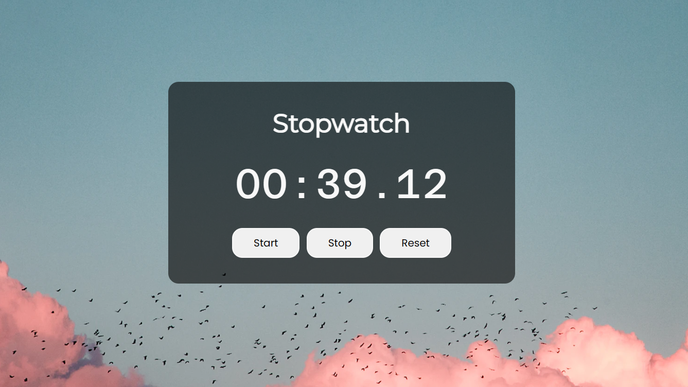

# Stopwatch App

A simple stopwatch web application with a clean and responsive design.



## Features

- Start, stop, and reset functionality.
- Clear display with minutes, seconds, and tenths of a second.
- Responsive design for various screen sizes.

## Technologies Used

- HTML
- CSS
- JavaScript

## How to Use

1. Clone the repository to your local machine:

   ```bash
   git clone https://github.com/your-username/stopwatch-app.git
   ```

2. Open index.html in your web browser.

3. Use the "Start", "Stop", and "Reset" buttons to control the stopwatch.
